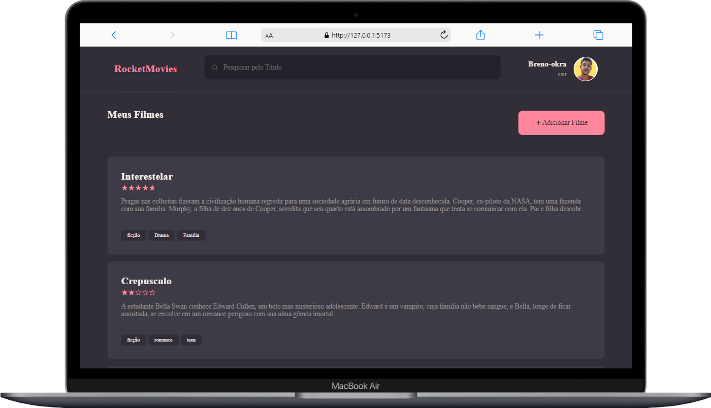
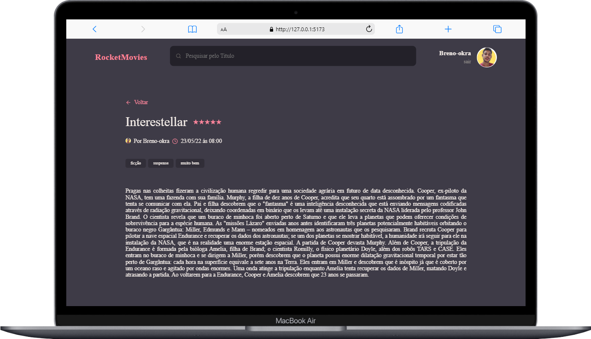
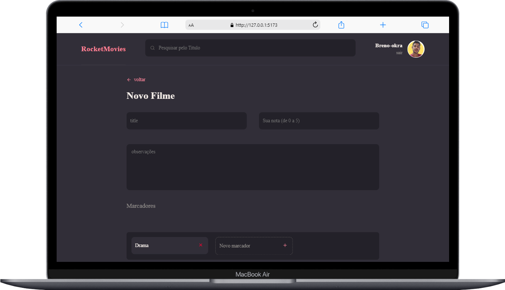

<h1 align="center"> Chaallenge ReactMovies of Project React Notes of the explorer rocketseat
</h1>

    
    

## 🚀 Techniques

this project was developed with technology:

- REACTjs
- Vite

## learning main

- react routes
- components react
- props
- style components

## about
project developed on explorer of rocketseat

## 💻 Photos Project 

    <h3>Home</h3>
    
    <h3>details</h3>
    
    <h3>new</h3>
    
    <h3>Profile</h3>
    

# React + Vite

This template provides a minimal setup to get React working in Vite with HMR and some ESLint rules.

Currently, two official plugins are available:

- [@vitejs/plugin-react](https://github.com/vitejs/vite-plugin-react/blob/main/packages/plugin-react/README.md) uses [Babel](https://babeljs.io/) for Fast Refresh
- [@vitejs/plugin-react-swc](https://github.com/vitejs/vite-plugin-react-swc) uses [SWC](https://swc.rs/) for Fast Refresh
